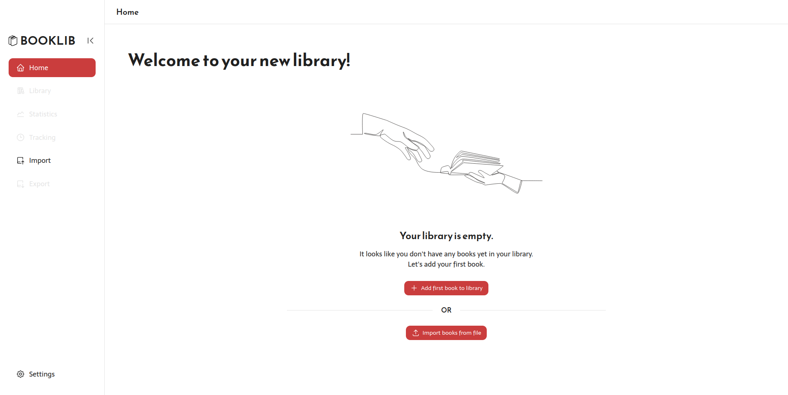
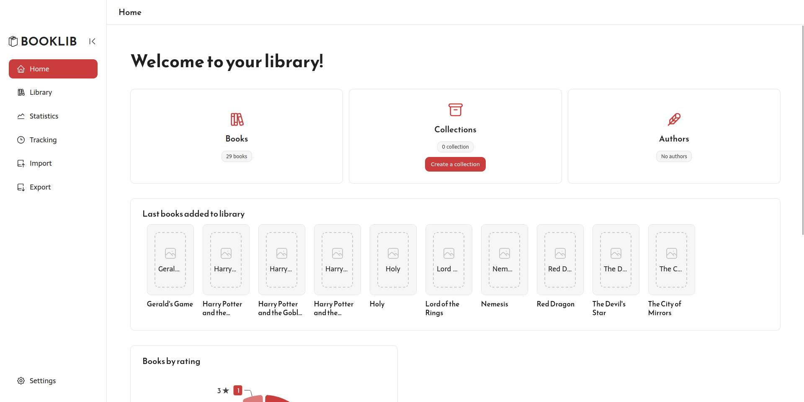
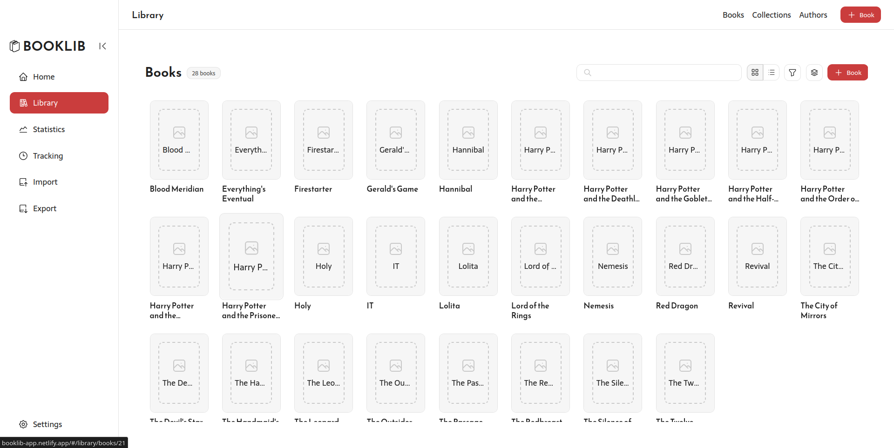
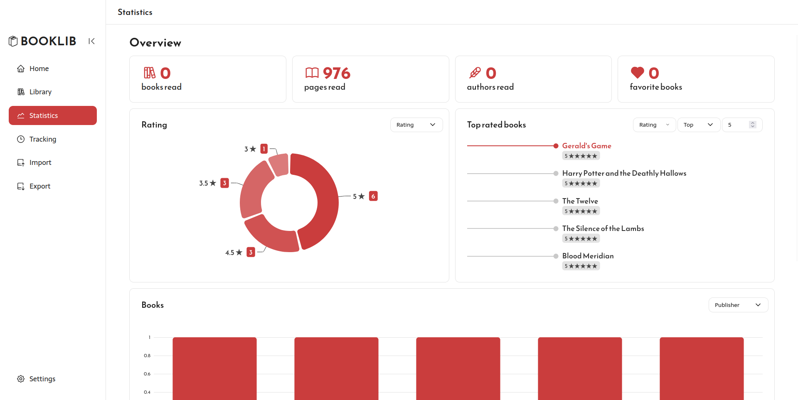
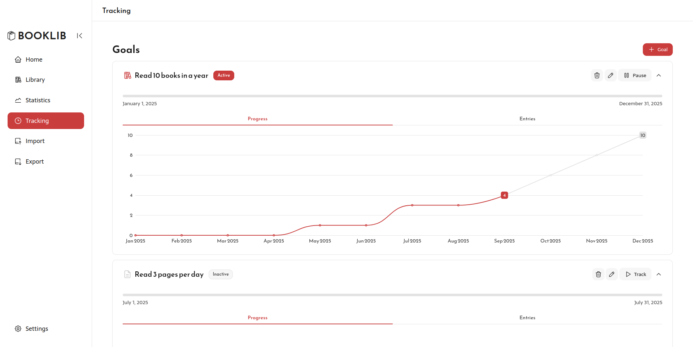
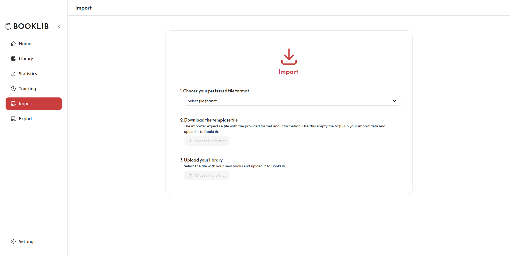

<div align="center">
  
  <h1>BookLib</h1>
  <p>Manage your personal library and reach your reading goals.</p>
  
  [](https://github.com/deadalley/booklib-app)
  [](https://nuxt.com)
  [](https://vuejs.org)
  [](https://www.typescriptlang.org)
  [](https://www.electronjs.org)
  
  [Getting Started](#quick-start) | [Development](#development)
</div>

---

<div align="center">
  <a href="https://booklib-app.netlify.app" target="_blank">
    
  </a>
</div>

<div>
  <div align="center">
    <h3>📖 Book Management</h3>
    <p>Manage your book collection, find your favorite books, organize them in collections, and so much more.</p>
  </div>
  <div align="center">
    <h3>🎯 Goal Tracking</h3>
    <p>Tracking your reading goals by books, pages, or hours and achieve your reading targets.</p>
  </div>
  <div align="center">
    <h3>📦 Importing & Exporting</h3>
    <p>Export and import your library in CSV and JSON formats for easy portability.</p>
  </div>
</div>

---

- [Quick Start](#quick-start)
  - [Installation](#installation)
- [Development](#development)
  - [Available Scripts](#available-scripts)
    - [Development](#development-1)
    - [Building](#building)
    - [Testing](#testing)
    - [Linting](#linting)
    - [Histoire](#histoire)
    - [Electron Distribution](#electron-distribution)
- [Architecture](#architecture)
  - [Tech Stack](#tech-stack)
  - [Project Structure](#project-structure)
  - [Storage Architecture](#storage-architecture)
- [Usage](#usage)
  - [Getting Started](#getting-started)
- [Testing](#testing-1)
- [Tools](#tools)
- [Screenshots](#screenshots)
  - [Start page](#start-page)
  - [Home page](#home-page)
  - [Library page](#library-page)
  - [Stats page](#stats-page)
  - [Tracking page](#tracking-page)
  - [Import page](#import-page)
- [License](#license)

---

## Quick Start

### Installation

1. **Clone the repository**

   ```bash
   git clone https://github.com/deadalley/booklib-app.git
   cd booklib-app
   ```

2. **Install dependencies**

   ```bash
   pnpm install
   ```

3. **Start development server**
   ```bash
   # Web version
   pnpm dev
   ```

The web application will be available at `http://localhost:3000`

## Development

### Available Scripts

#### Development

```bash
pnpm dev              # Start web development server
```

#### Building

```bash
pnpm build:electron  # Build for Electron (desktop app)
pnpm build:web       # Build for web deployment
pnpm preview         # Preview production build
```

#### Testing

```bash
pnpm test            # Run unit tests
pnpm test:e2e        # Run end-to-end tests
pnpm test:e2e:ui     # Run e2e tests with UI
pnpm coverage        # Generate test coverage report
```

#### Linting

```bash
pnpm lint            # Run all linters
pnpm lint:fix        # Fix linting issues
pnpm lint:js         # ESLint JavaScript/TypeScript
pnpm lint:ts         # TypeScript type checking
pnpm lint:prettier   # Prettier formatting check
```

#### Histoire

```bash
pnpm story:dev       # Start Storybook development server
pnpm story:build     # Build Storybook
pnpm story:preview   # Preview built Storybook
```

#### Electron Distribution

```bash
pnpm electron:build        # Build for current platform
pnpm electron:build:win    # Build for Windows
pnpm electron:build:mac    # Build for macOS
pnpm electron:build:linux  # Build for Linux
pnpm electron:publish      # Build and publish
```

## Architecture

### Tech Stack

- **Frontend**: Vue 3 + Nuxt 3 + TypeScript
- **Styling**: Tailwind CSS
- **Charts**: ECharts with vue-echarts
- **Icons**: Tabler Icons
- **Forms**: FormKit
- **Tables**: TanStack Table
- **Testing**: Vitest + Playwright
- **Desktop**: Electron
- **Database**: LowDB (JSON-based)

### Project Structure

```
booklib-app/
├── components/         # Vue components
├── composables/        # Vue composables
├── pages/             # Nuxt pages (routing)
├── layouts/           # Nuxt layouts
├── services/          # Business logic and data management
├── types/             # TypeScript type definitions
├── utils/             # Utility functions
├── assets/            # Static assets and styles
├── public/            # Public static files
├── electron/          # Electron main process files
├── tests/             # Test files
└── playwright-report/ # E2E test reports
```

### Storage Architecture

BookLib uses a flexible storage system that adapts to the environment:

- **Electron**: File-based storage in user data directory
- **Web**: LocalStorage fallback for browser compatibility

See [STORAGE_ARCHITECTURE.md](STORAGE_ARCHITECTURE.md) for detailed information.

## Usage

### Getting Started

1. **Add your first book** - Use the "+" button to manually add books or search Google Books
2. **Create collections** - Organize books into custom collections
3. **Set reading goals** - Track your reading progress with customizable goals
4. **Import your library** - Bulk import books from CSV or other formats

## Testing

- **Unit tests** with Vitest
- **End-to-end tests** with Playwright
- **Visual testing** with Histoire

Run tests:

```bash
pnpm test           # Unit tests
pnpm test:e2e       # E2E tests
pnpm lint:ts        # Type checking
```

## Tools

- [Nuxt 3](https://nuxt.com/)
- [Vue 3](https://vuejs.org/)
- [Tailwind CSS](https://tailwindcss.com/)
- [ECharts](https://echarts.apache.org/)
- [Electron](https://www.electronjs.org/)

## Screenshots

<details>
<summary>View screenshots</summary>

### Start page



### Home page



### Library page



### Stats page



### Tracking page



### Import page



</details>

## License

This project is licensed under the MIT License. See the [LICENSE](LICENSE) file for details.
